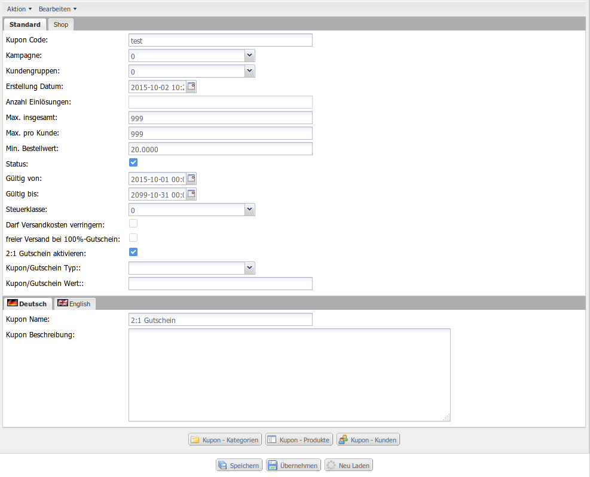

2:1 Gutschein
=============

> ew_2to1_coupon

Dieses Plugin bietet Ihren Kunden die Möglichkeit einen bereits im Warenkorb befindlichen Artikel noch einmal kostenlos in den Warenkorb zu legen. Der Kunde kann somit zwei Produkte zum Preis von einem bestellen.

Leistung
--------

-	Nutzung vorhandener Strukturen; Erweiterung des Standard xt_coupons Plugin
-	Wenn 2:1 Gutschein eingelöst wurde, kann jedes der im Warenkorb befindlichen Produkte noch einmal kostenlos in den Warenkorb gelegt werden
-	Aktivierung des 2:1 Gutscheins je Coupon über die Coupon - Vorlage
-	Es kann ein Mindest- und/oder Maximalpreis für die 2:1 Artikel festgelegt werden
-	Prüfung ob Warenkorb-Produkt ein Gratisprodukt des Plugins vt_free_products ist. Wenn es ein Gratisprodukt ist, wird dieses nicht für den 2:1 Gutschein zur Verfügung gestellt

<div class="page-break"></div>

Installation
------------

1.	**Backup** Ihrer Shop-Installation.
2.	**Upload der Lizenzdatei** in das Verzeichnis `lic/` *(sofern Sie eine Lizenz von uns erhalten haben)*.
3.	**Upload des Plugins** in das Verzeichnis `plugins/`.
4.	**Installation des Plugins** im Shop Backend unter **Plugins --> deinstallierte Plugins**. Bei älteren Shop-Versionen finden Sie diesen Menüpunkt unter **Inhalte**.
5.	**Aktivierung des Plugins** unter **Plugins --> installierte Plugins**. Bei älteren Shop-Versionen finden Sie diesen Menüpunkt unter **Inhalte**.
6.	**Konfiguration & Aktivierung für den jeweiligen Mandanten** in den Plugin-Einstellungen.
7.	**Cache löschen** unter **System --> Cache --> Cache entleeren --> All** und ggf. in Ihrem Browser.
8.	**Aktualisieren Sie das Backend** des Shops in Ihrem Browser *(Unter Windows bspw. mittels Taste F5 möglich)*.

Konfiguration
-------------

Sie können das Plugin je Mandant individuell konfigurieren. Nachstehend sind die verfügbaren Optionen im Detail beschrieben. Bitte nehmen Sie keine Änderung an den Feldern **Code** und **Name** vor.

| Option                          | Beschreibung                                                               |
|---------------------------------|----------------------------------------------------------------------------|
| Plugin Status                   | De-/Aktivieren Sie das Plugin für alle Mandanten                           |
| Für diesen Mandanten aktivieren | De-/Aktivieren Sie das Plugin für diesen Mandanten                         |
| Minimum Preis des 2:1 Produkt   | Mindest-Nettopreis für die verfügbaren 2:1 Produkte (Mit `0` deaktivieren) |
| Maximum Preis des 2:1 Produkt   | Maximal-Nettopreis für die verfügbaren 2:1 Produkte (Mit `0` deaktivieren) |

<div class="page-break"></div>

Verknüpfung zu einem Coupon
---------------------------

Jeder Coupon kann zu einem 2:1 Gutschein konfiguriert werden. Das Plugin fügt der Coupon Vorlage eine weitere Option **2:1 Gutschein aktivieren** hinzu.



<div class="page-break"></div>

Anwendung von Pluginfunktionen im Shoptemplate
----------------------------------------------

Fügen Sie folgenden Hookpoint an gewünschter Stelle in in die Dateien `templates/IHR_SHOP_TEMPLATE/xtCore/pages/cart.html` und `templates/IHR_SHOP_TEMPLATE/xtCore/pages/checkout/subpage_confirmation.html` ein.

```
{hook key=ew_2to1_coupon}
```

> Die Anzeige erfolgt auf der Warenkorb- und/oder Checkoutseite, je nach Einstellung von Plugin `xt_coupons`

Weiterhin können Sie in der Warenkorb- und Checkoutauflistung der Produkte abfragen, ob das Produkt ein 2:1 Produkt ist. Die Produktdaten enthalten das Attribut `ew_2to1_coupon_product`. Somit ist es bspw. möglich das Feld für die Produktanzahl auszublenden.

Beispiel:

```
{if !$data.ew_2to1_coupon_product}
	<input type="text" class="form-control" value="{$data.products_quantity}" placeholder="{txt key=TEXT_QTY}" />
{else}
    <input type="hidden" name="qty[]" value="{$data.products_quantity}" />
    <input type="text" class="form-control" value="{$data.products_quantity}" placeholder="{txt key=TEXT_QTY}" disabled />
{/if}
```

<div class="page-break"></div>

Kontakt
-------

```
Internetagentur 8works
Brigittastrasse 9
45130 Essen

Telefon: (+49) 201 29 88 58 8
Telefax: (+49) 201 29 88 58 6

eMail: info@8works.de
Internet: http://www.8works.de

SteuerNr: 112/5414/1997
UST-ID: DE258921027

Geschäftsleitung:
Oliver Stiegler
```
