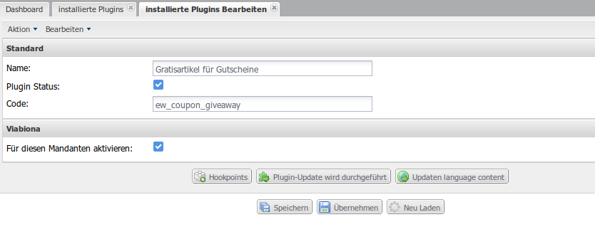
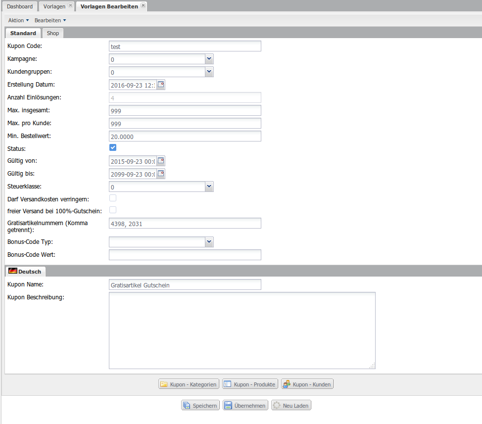

Gratisartikel für Gutscheine
============================

> ew_coupon_giveaway

Kunde erhält durch die Eingabe eines Gutschein-Codes Gratisartikel, welche je Gutschein vom Shopbetreiber festgelegt werden können. Je Gutschein sind ein oder mehrere Gratisartikel möglich. Die Standard-Funktionen des Gutschein bleiben erhalten (Rabatt, etc.).

Leistung
--------

-	Erweiterung des Plugins `xt_coupons`
-	Je Gutschein können die Gratisartikel mit Hilfe eines neuen Textfeldes bestimmt werden. In dieses Textfeld werden Artikelnummern komma-separiert eingetragen. Mehrere Artikelnummern sind möglich. Sobald eine Artikelnummer angegeben wird ist die Funktion für den betreffenden Gutschein aktiv.
-	Gratisartikel werden dem Warenkorb automatisch nach den konfigurierten Kriterien des Gutscheins hinzugefügt (Eingabe des Codes, Mindestbestellwert, hinterlegte Artikelnummern, etc.)
-	Gratisartikel können aus dem Warenkorb nicht entfernt werden
-	Wenn Kriterien des Gutscheins nicht mehr gegeben sind, werden auch die Gratisartikel aus dem Warenkorb automatisch entfernt (manuelles entfernen des Gutscheins, unterschreiten des Mindestbestellwertes, etc.)
-	Gratisartikel werden als einzelne neue Artikel hinzugefügt für 0 EUR, auch wenn das gleiche Produkt schon im Warenkorb existiert
-	Die Anzahl der Gratisartikel kann vom Benutzer nicht geändert werden
-	Funktion ist auf Warenkorb- sowie Checkoutseite gegeben

Installation
------------

1.	**Backup** Ihrer Shop-Installation.
2.	**Upload der Lizenzdatei** in das Verzeichnis `lic/` *(sofern Sie eine Lizenz von uns erhalten haben)*.
3.	**Upload des Plugins** in das Verzeichnis `plugins/`.
4.	**Installation des Plugins** im Shop Backend unter **Plugins --> deinstallierte Plugins**. Bei älteren Shop-Versionen finden Sie diesen Menüpunkt unter **Inhalte**.
5.	**Aktivierung des Plugins** unter **Plugins --> installierte Plugins**. Bei älteren Shop-Versionen finden Sie diesen Menüpunkt unter **Inhalte**.
6.	**Konfiguration & Aktivierung für den jeweiligen Mandanten** in den Plugin-Einstellungen.
7.	**Cache löschen** unter **System --> Cache --> Cache entleeren --> All** und ggf. in Ihrem Browser.
8.	**Aktualisieren Sie das Backend** des Shops in Ihrem Browser *(Unter Windows bspw. mittels Taste F5 möglich)*.

<div class="page-break"></div>

Konfiguration
-------------



Sie können das Plugin je Mandant individuell konfigurieren. Nachstehend sind die verfügbaren Optionen im Detail beschrieben. Bitte nehmen Sie keine Änderung an den Feldern **Code** und **Name** vor.

| Option                          | Beschreibung                                       |
|---------------------------------|----------------------------------------------------|
| Plugin Status                   | De-/Aktivieren Sie das Plugin für alle Mandanten   |
| Für diesen Mandanten aktivieren | De-/Aktivieren Sie das Plugin für diesen Mandanten |

<div class="page-break"></div>

Verknüpfung zu einem Gutschein
------------------------------



Sie können jeder Gutschein-Vorlage unter **Shop --> Coupons --> Vorlagen --> Vorlage erstellen / Vorlage bearbeiten** ein oder mehrere Gratisartikel zuweisen. Tragen Sie hierzu in das neue Feld **Gratisartikelnummern** eine komma-separierte Liste von gültigen Artikelnummern ein und speichern den Datensatz ab.

<div class="page-break"></div>

Kontakt
-------

```
Internetagentur 8works
Brigittastrasse 9
45130 Essen

Telefon: (+49) 201 29 88 58 8
Telefax: (+49) 201 29 88 58 6

eMail: info@8works.de
Internet: http://www.8works.de

SteuerNr: 112/5414/1997
UST-ID: DE258921027

Geschäftsleitung:
Oliver Stiegler
```
